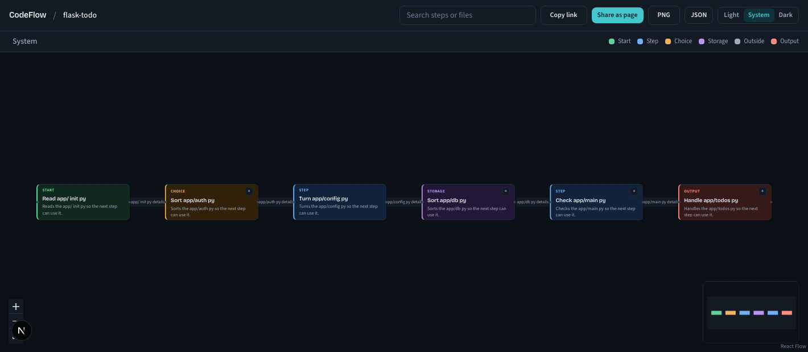
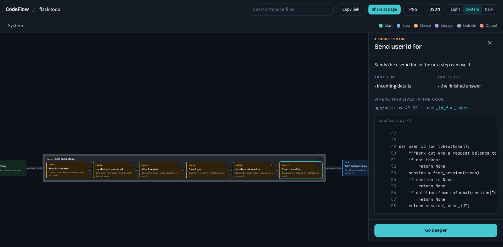
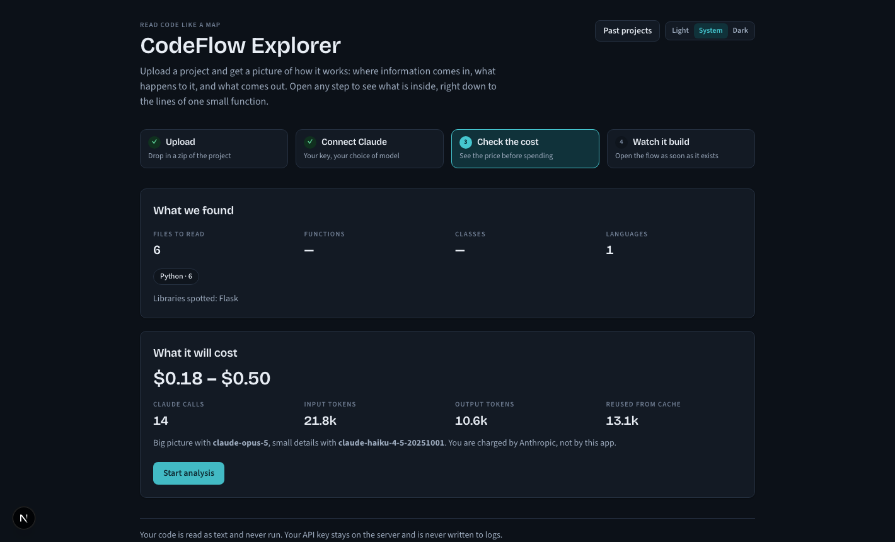
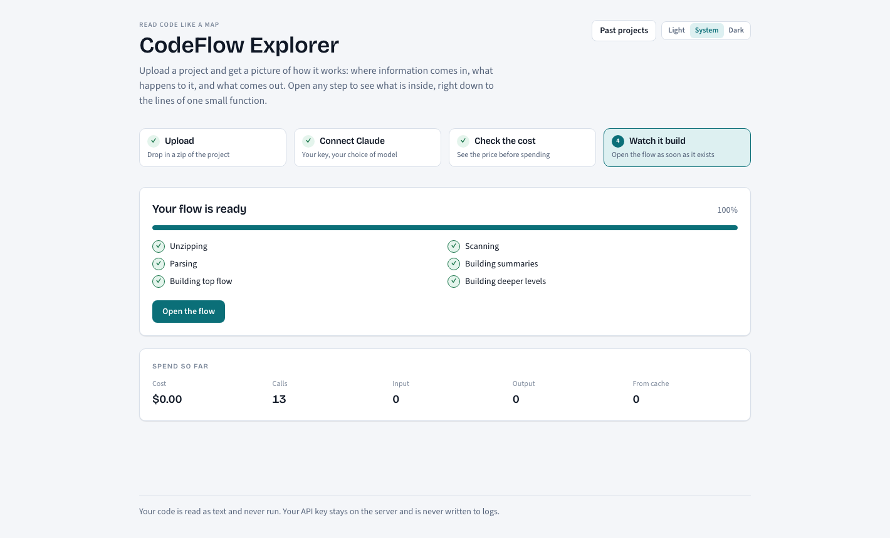
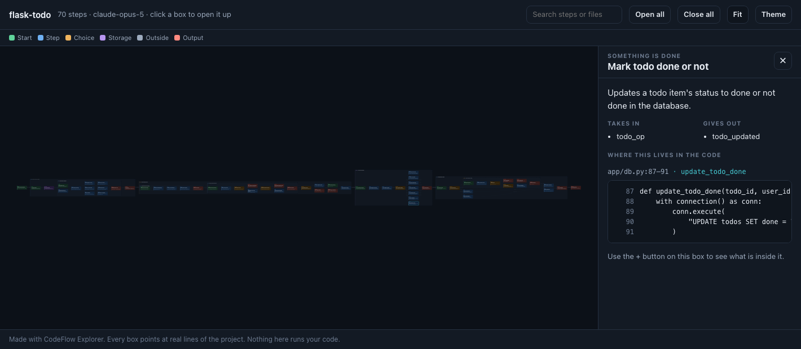
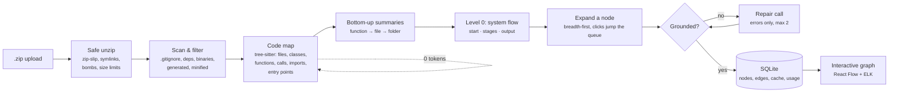

<div align="center">

# CodeFlow Explorer

**Upload a codebase. Read how it works as a flow you can open up — from "where information comes in" down to the lines inside one small function.**

Every box points at real code. Every explanation is written for someone who has never programmed.

[](https://www.python.org/)
[](https://nodejs.org/)
[](https://fastapi.tiangolo.com/)
[](https://nextjs.org/)
[](https://platform.claude.com/)
[](https://github.com/Baharul0111/CodeFlow-Explorer/actions/workflows/ci.yml)
[](https://baharul0111.github.io/CodeFlow-Explorer/)



**[▶ Explore a live graph in your browser](https://baharul0111.github.io/CodeFlow-Explorer/)** — no install, no key

</div>

---

## Contents

- [Try it without installing anything](#try-it-without-installing-anything)
- [What it does](#what-it-does)
- [Why it's different](#why-its-different)
- [Screenshots](#screenshots)
- [Quick start](#quick-start)
- [Getting an Anthropic API key](#getting-an-anthropic-api-key)
- [How it works](#how-it-works)
- [Sharing a graph](#sharing-a-graph)
- [Cost and token efficiency](#cost-and-token-efficiency)
- [Language support](#language-support)
- [Configuration](#configuration)
- [Project structure](#project-structure)
- [Development](#development)
- [Testing](#testing)
- [Security](#security)
- [Troubleshooting](#troubleshooting)
- [Limitations](#limitations)
- [Contributing](#contributing)
- [License](#license)

---

## What it does

You drop in a `.zip` of any project and connect your own Anthropic API key. CodeFlow Explorer reads
the code **statically** — it never runs it — and turns it into a flow graph you can drill into:

```
START  →  Check login details  →  Save order to database  →  Send confirmation  →  OUTPUT
             ↑ click any box to see what is inside it, level after level
```

- **Level 0** — the whole system: where data enters, the main stages, what comes out.
- **Level 1+** — click a stage to open it into modules, then files, then functions.
- **Leaf level** — one small function broken into its own steps, each tied to real line numbers.

Every node is colour-coded by what it does (start, step, choice, storage, outside service, output),
and every arrow is labelled with the data that actually moves — `email + password`, not `data`.

## Why it's different

| | |
|---|---|
| **Grounded in real code** | tree-sitter builds a map of the real files, functions, classes and call sites first. Claude may only describe things in that map. Output referencing a file, symbol or line that isn't in your upload is **rejected and regenerated**, not shown. |
| **Written for non-programmers** | Titles are verb phrases of five words or fewer. Explanations are 25 words of plain English. No jargon, and the model is told to say "probably" rather than invent. |
| **Cheap by design** | Static analysis does everything it can for free. Summaries flow upward so raw code is only ever sent at function level. Prompt caching, batching, content-hash caching, and a cheap model for deep levels. You see a cost estimate before anything runs. |
| **Bring your own key** | No accounts, no passwords, no vendor lock-in. Your key stays on the server, encrypted if you ask it to be remembered, and never reaches the browser or the logs. |
| **Shareable** | Copy a live link, or download one HTML file that opens and expands on any machine with no server and no internet. |
| **Never executes your code** | Uploads are read as text and parsed. Nothing is imported, installed, built or run — ever. |

## Screenshots

<table>
<tr>
<td width="50%">

<p align="center"><em>Open a stage in place; the side panel shows the exact lines it refers to</em></p>
</td>
<td width="50%">

<p align="center"><em>See what was found and what it will cost <strong>before</strong> spending anything</em></p>
</td>
</tr>
<tr>
<td width="50%">

<p align="center"><em>Live progress with running tokens and cost — open the graph as soon as level 0 is ready</em></p>
</td>
<td width="50%">

<p align="center"><em>The exported single-file page — same interactions, no server, no internet</em></p>
</td>
</tr>
</table>

> [!NOTE]
> These screenshots were taken in **demo mode** (`LLM_MODE=mock`), which fills the boxes with
> deterministic placeholder wording so the app can be demonstrated without an API key. With a real
> key the structure is identical and the writing is genuinely explanatory.

---

## Try it without installing anything

**[baharul0111.github.io/CodeFlow-Explorer](https://baharul0111.github.io/CodeFlow-Explorer/)**
hosts four already-analysed projects. Each one is the app's own single-file export, so you can pan,
zoom, open steps and read the code straight in your browser.

Those pages are static snapshots. To analyse **your own** code you run the app locally — it needs
its Python backend to unzip, parse and talk to Claude.

---

## Quick start

### Prerequisites

| Tool | Version | Why |
|---|---|---|
| [uv](https://docs.astral.sh/uv/) | latest | Installs Python 3.12 and the backend dependencies |
| [Node.js](https://nodejs.org/) | 22+ | Runs the frontend (pnpm 11 needs 22.13+) |
| [pnpm](https://pnpm.io/) | 11+ | Frontend package manager |
| An Anthropic API key | — | [How to get one](#getting-an-anthropic-api-key) — or skip it and use demo mode |

### Install and run

```bash
git clone https://github.com/Baharul0111/CodeFlow-Explorer.git
cd CodeFlow-Explorer
cp .env.example .env        # optional — every setting has a sensible default
make install                # backend deps, frontend deps, Playwright's browser
make dev                    # backend on :8000, frontend on :3000
```

Open **<http://localhost:3000>** and upload a project.

### Try it in 60 seconds, without a key

Demo mode runs the entire pipeline against a deterministic stand-in for Claude. It still parses
your real code and still produces a grounded graph — only the wording is placeholder.

```bash
make samples                                  # builds four example projects into samples/dist/
cd backend && LLM_MODE=mock uv run uvicorn app.main:app --port 8000
# in another terminal
cd frontend && pnpm dev
```

Then upload `samples/dist/flask-todo.zip`.

### Run with Docker

```bash
docker compose up --build
```

Frontend on <http://localhost:3000>, API on <http://localhost:8000>. Uploads and the database live
in named volumes, so they survive a restart.

---

## Getting an Anthropic API key

1. Sign in at **[platform.claude.com](https://platform.claude.com)**.
2. Go to **Settings → API keys** and create a key. It starts with `sk-ant-`.
3. Add credits under **Billing** — a brand-new key with no credits cannot make calls.
4. Paste it into the **Connect Claude** step and press **Test connection**.

The app then calls the Anthropic **Models API** with your key and fills the model dropdown with the
models *your* account can actually use, each tagged most capable / balanced / cheapest. Before you
test a key, it shows a fallback list from `backend/config/models.json`.

**Where your key goes:** into server memory, behind an opaque session token. The browser only ever
holds the token. Tick *Remember key on this server* and it is encrypted with Fernet before touching
disk; **Forget my key** erases it. Keys are stripped from every log line and every error message by
a redaction processor, which has its own test.

---

## How it works



**The key idea:** deterministic analysis first, language model second. tree-sitter produces the
ground truth — a menu of real code units with real line ranges. Claude is then only ever asked to
*describe and group things from that menu*. That's what makes "every box points at real code" a
guarantee the tests can check, rather than a hope.

Validation on every generated level:

- Child nodes may only use ids from the menu they were given.
- The children must together cover **all** of the parent's code — anything left out triggers a
  repair call containing only the problem, never the whole context again.
- Step-level nodes must sit inside the real line range of their function.
- Over-long titles, missing edges, and a level-0 flow without a start or output node are repaired
  locally without spending another call.

Full design and the alternatives that were rejected: **[docs/ARCHITECTURE.md](docs/ARCHITECTURE.md)**.

---

## Sharing a graph

The graph screen has four ways out, from most to least interactive:

| Button | What you get | Who can open it |
|---|---|---|
| **Copy link** | `…/projects/<id>/graph` | Anyone who can reach your server — live, always current |
| **Share as page** | One `.html` file (~160 KB for a small project) with the whole graph, every code snippet, and a viewer | **Anyone, anywhere.** No server, no internet, no install — double-click it |
| **PNG** | A picture of the current view | Anyone, for a slide or a ticket |
| **JSON** | Nodes and edges | Your own tooling |

**Share as page** is the one to send to someone who doesn't have the app. Inside that single file
they can pan and zoom, open and close any step, open everything at once, search, and read the real
code with line numbers. It is a snapshot: it never phones home, and it doesn't update when you
generate more levels — re-export to share a newer version.

---

## Cost and token efficiency

Before anything runs you get an estimate built from **real token counts** — Anthropic's
`count_tokens` endpoint on a representative sample of your code, extrapolated across the number of
calls the pipeline will make. During the run the header shows input, output, cache-write and
cache-read tokens with a running dollar total. Per-model prices live in
[`backend/config/models.json`](backend/config/models.json) and are edited there, never in code.

| Measure | Effect |
|---|---|
| Static analysis first | The entire code map — files, functions, calls, entry points — costs **zero tokens** |
| Summaries flow upward | Raw code is only sent at function level, and only that function's lines |
| Prompt caching | Two cached system blocks (global rules, project context) reused by every call |
| Batching | Up to 12 function summaries per call instead of one call each |
| Trivial-function skip | Getters, setters and one-liners are described from static data, no call at all |
| Structured outputs | A strict JSON schema means no prose, no format retries, tight `max_tokens` |
| Content-hash cache | Identical code — across projects or a re-upload — is free |
| Smart mix | Cheap model for the many small deep calls, your chosen model for the big picture |
| Cost limit | Analysis pauses and asks before passing `MAX_COST_PER_PROJECT_USD` |

**Reopening an analysed project reads from SQLite and costs nothing.** There is a test that asserts
exactly that.

---

## Language support

Full structural analysis — functions, classes, parameters, return types, docstrings, call sites,
imports and entry points — via pinned tree-sitter grammars (no downloads at runtime):

`Python` · `JavaScript` · `TypeScript` (incl. JSX/TSX) · `Java` · `Go` · `C` · `C++` · `C#` ·
`Ruby` · `PHP` · `Rust`

Other text files (Kotlin, Swift, Scala, Elixir, shell, SQL, YAML, …) are still scanned, summarised
and placed in the graph, but don't get function- or step-level detail.

Entry points detected automatically: `main` functions and `if __name__ == "__main__"`, HTTP routes
(decorators, annotations, attribute lists and `app.get(...)`-style calls), server starts, CLI
commands, event/queue handlers, cron jobs, frontend roots and pages, plus `package.json`,
`pyproject.toml`, `Dockerfile` and `Procfile` hints.

---

## Configuration

Copy `.env.example` to `.env`. Everything has a default; nothing is required.

| Setting | Default | What it does |
|---|---|---|
| `ANTHROPIC_API_KEY` | – | Optional, local dev only: pre-fills the Connect screen |
| `LLM_MODE` | `anthropic` | `mock` runs the pipeline with a deterministic stand-in — no key needed |
| `DEFAULT_MODEL_FALLBACKS` | opus 5, sonnet 5, haiku 4.5 | Models listed before a key is tested |
| `MAX_UPLOAD_MB` | `200` | Largest zip accepted |
| `MAX_UNZIPPED_MB` | `1024` | Largest unpacked size |
| `MAX_FILES` | `20000` | Most files in one project |
| `MAX_COST_PER_PROJECT_USD` | `5` | Spend guard — analysis pauses here and asks |
| `LLM_CONCURRENCY` | `4` | Claude calls in flight at once |
| `BACKGROUND_MAX_NODES` | `200` | Nodes pre-built before switching to on-demand |
| `KEY_ENCRYPTION_SECRET` | auto | Encrypts remembered keys; generated into `workspace/` if unset |
| `DATABASE_URL` | SQLite file | Where projects, nodes, cache and usage are stored |
| `WORKSPACE_RETENTION_DAYS` | `7` | Uploads older than this are deleted at startup |
| `FRONTEND_ORIGIN` | `http://localhost:3000` | The **only** origin CORS allows |
| `NEXT_PUBLIC_API_URL` | `http://localhost:8000` | Where the browser finds the API |

---

## Project structure

```
codeflow-explorer/
├── backend/                  FastAPI, Python 3.12, fully async
│   ├── app/
│   │   ├── api/              routes, schemas, error shape, rate limiting, DI
│   │   ├── parsing/          tree-sitter code map: grammars, extractor, resolver, entry points
│   │   ├── pipeline/         unzip, scan, units, summaries, flow, grounding, jobs, SSE, cost
│   │   ├── llm/              ClaudeClient protocol, Anthropic impl, mock, key store, catalogue
│   │   ├── export/           self-contained shareable HTML page
│   │   └── models/           SQLAlchemy 2 async ORM
│   ├── config/models.json    fallback models, prices per MTok, tier hints  ← edit prices here
│   └── tests/                122 pytest tests (no API key required)
├── frontend/                 Next.js 16, React 19, TypeScript strict, Tailwind 4
│   ├── src/app/              upload wizard, projects list, graph screen
│   ├── src/components/       wizard steps, graph canvas, side panel, UI primitives
│   ├── src/lib/              typed API client (zod), ELK layout, graph state
│   └── e2e/                  Playwright journey + screenshot capture
├── samples/                  four runnable example projects + a zip builder
├── docs/ARCHITECTURE.md      design, decisions, and what was rejected
├── CLAUDE.md                 working agreement for AI coding assistants
└── docker-compose.yml
```

### Stack

**Backend** FastAPI · SQLAlchemy 2 (async) · SQLite · Pydantic · tree-sitter · `anthropic` SDK ·
structlog · SSE
**Frontend** Next.js 16 (App Router) · React 19 · TypeScript (strict) · Tailwind CSS 4 ·
`@xyflow/react` · elkjs · zod
**Tooling** uv · pnpm · ruff · mypy (strict) · ESLint · Prettier · pytest · Playwright · pre-commit

---

## Development

| Task | Command |
|---|---|
| Install everything | `make install` |
| Run both servers | `make dev` |
| Backend only | `make dev-backend` |
| Frontend only | `make dev-frontend` |
| Backend tests | `make test-backend` |
| Playwright end-to-end | `make e2e` |
| Lint + types, both sides | `make lint` |
| Everything CI should run | `make check` |
| Auto-format | `make fmt` |
| Rebuild sample zips | `make samples` |
| Re-capture README screenshots | `cd frontend && pnpm screenshots` |

Enable the pre-commit hooks (ruff, mypy, ESLint, Prettier) with:

```bash
cd backend && uv run pre-commit install
```

### Code standards

- **Python** — 3.12, full type hints, `mypy --strict` clean, ruff for lint and format, 100-column
  lines. Small single-purpose modules; pure functions in `pipeline/` and `parsing/`; I/O at the
  edges. The Claude client is dependency-injected, never constructed inside pipeline code.
- **TypeScript** — `strict: true`, no `any`, every API response validated with zod, keyboard
  accessible, light and dark themes driven by tokens.
- **Errors** — typed exceptions carrying a user-facing message; the API returns
  `{"error": {"code", "message"}}` in plain English, never a stack trace.

---

## Testing

```bash
make check    # lint + types + 122 backend tests
make e2e      # 6 Playwright tests in a real browser
```

Nothing in the test suite needs an API key — every LLM path runs through `MockClaudeClient`, which
is payload-driven, so tests exercise the *real* pipeline (grounding, coverage, repair, caching,
persistence, SSE) rather than canned fixtures.

What's covered, beyond the usual unit tests:

- **Malicious archives** — zip-slip, absolute paths, symlinks, encrypted entries, entry-count and
  size limits, compression-ratio bombs, and headers that lie about their size.
- **Grounding** — invented ids, missing and duplicated coverage, and line ranges outside the real
  function are all rejected; every code reference in every sample is checked against the file on
  disk and its actual line count.
- **All four samples** run through the complete pipeline and must each produce a start node, an
  output node, labelled edges and more than one level.
- **Cost** — the limit genuinely pauses a run; re-analysing identical code costs nothing; prompt
  caching produces cache reads; the cached prefix is byte-identical between calls.
- **Keys** — never appear in logs, responses or the browser; the error mapping for invalid key, no
  credits, unavailable model and rate limiting is asserted message by message.
- **Browser journey** — upload → connect → estimate → analyse → drill to a leaf → side panel shows
  the right file and lines, plus search, export, sharing, zero-cost reopen, and a rejected zip.

---

## Security

- **Uploaded code is never executed, imported, installed or built.** It is read as text and parsed.
- **Uploaded code is untrusted data.** Prompts instruct Claude to ignore any instructions found
  inside it, and model output can only ever become validated graph JSON — it can't trigger actions.
- **Archive defences:** path traversal, absolute paths, symlinks and device files, encrypted
  entries, entry count, declared size, per-file and whole-archive compression ratios, plus a
  streaming byte counter that catches a header lying about its size.
- **Snippets** are served only from inside the project's own workspace, after path normalisation,
  with symlinks refused.
- **Keys** live in server memory keyed by an opaque token; encrypted with Fernet at rest only if
  you opt in; redacted from all logs and errors; never returned to the browser.
- **HTTP:** CORS locked to `FRONTEND_ORIGIN`, secure headers on every response, and per-session or
  per-IP rate limits on uploads and analysis.
- **Retention:** workspaces older than `WORKSPACE_RETENTION_DAYS` are deleted at startup.

Found a security issue? Please open a private advisory rather than a public issue.

---

## Troubleshooting

<details>
<summary><strong>"This key is not valid"</strong></summary>

The key was rejected by Anthropic. Check for a stray space, confirm it starts with `sk-ant-`, and
make sure it hasn't been revoked in the console.
</details>

<details>
<summary><strong>"Your account has no credits"</strong></summary>

The key is valid but the account can't spend. Add credits under **Billing** at
platform.claude.com. The app checks this up front with a one-token request so you find out before
starting an analysis, not halfway through.
</details>

<details>
<summary><strong>"This model isn't available for your key"</strong></summary>

Your organisation can't use that model. Pick another from the dropdown — the list is fetched live
from your account, so anything in it should work.
</details>

<details>
<summary><strong>Analysis paused partway through</strong></summary>

It hit `MAX_COST_PER_PROJECT_USD`. Everything built so far is saved and viewable. Raise the limit
in `.env` (or pass a higher one on the estimate screen) and start again — cached work is reused, so
the restart is cheap.
</details>

<details>
<summary><strong>CORS errors in the browser console</strong></summary>

The backend only accepts the origin in `FRONTEND_ORIGIN`. If you're running the frontend on a port
other than 3000, set `FRONTEND_ORIGIN` to match and restart the backend.
</details>

<details>
<summary><strong>Port 3000 or 8000 already in use</strong></summary>

The frontend honours `PORT` (`PORT=3100 pnpm dev`), and the backend takes `--port`. Remember to
update `FRONTEND_ORIGIN` and `NEXT_PUBLIC_API_URL` to match.
</details>

<details>
<summary><strong>The graph looks thin for a big project</strong></summary>

Background generation stops at `BACKGROUND_MAX_NODES` (200 by default) and switches to on-demand —
clicking a node generates it immediately. Raise that number to pre-build more.
</details>

---

## Limitations

- **Static analysis only.** Calls made through dynamic dispatch, reflection, dependency injection
  or names built from strings can't be resolved. They're marked unknown rather than guessed at.
- **Languages without a grammar** get file-level summaries but no function- or step-level detail.
- **Very large projects** are bounded by `MAX_FILES` and `BACKGROUND_MAX_NODES`; beyond that,
  levels are generated when you click them.
- **Quality follows the model.** A cheap model on deep levels is usually indistinguishable at the
  top. Turn Smart mix off to use one model everywhere.
- **Single node by design.** SQLite and an in-process job queue suit a bring-your-own-key tool. The
  storage and job interfaces are the seams to replace if that ever changes.
- **Not a security tool.** The graph describes what the code appears to do; it does not audit it.

---

## Contributing

Issues and pull requests are welcome.

1. Fork and branch from `main`.
2. `make install`, then `cd backend && uv run pre-commit install`.
3. Make your change **with a test** — new pipeline behaviour needs one.
4. `make check && make e2e` must be green.
5. Open a PR describing what changed and why.

Please read [CLAUDE.md](CLAUDE.md) first: it holds the architecture summary, the coding standards,
and the hard rules (never execute uploaded code, always ground output in the code map, never log a
key, never hardcode a model id).

---

## License

No license has been chosen yet. Until a `LICENSE` file is added, default copyright applies and
others have no rights to use, modify or distribute this code. If you want it to be open source,
[MIT](https://choosealicense.com/licenses/mit/) is the usual choice for a project like this — add
the file and update this section.

---

## Acknowledgements

Built with [tree-sitter](https://tree-sitter.github.io/tree-sitter/),
[React Flow](https://reactflow.dev/), [ELK](https://eclipse.dev/elk/),
[FastAPI](https://fastapi.tiangolo.com/) and the [Claude API](https://platform.claude.com/).
