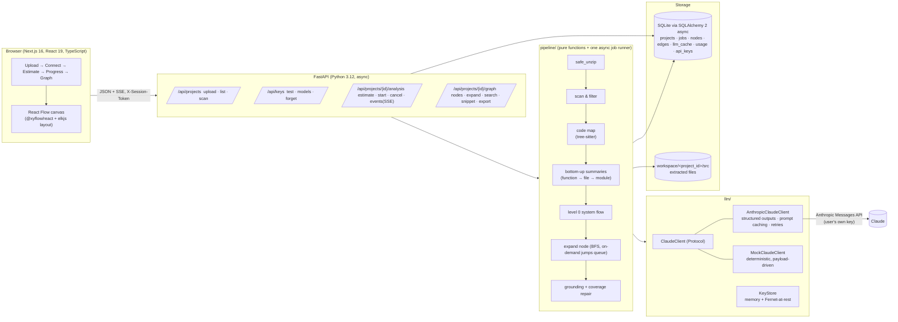
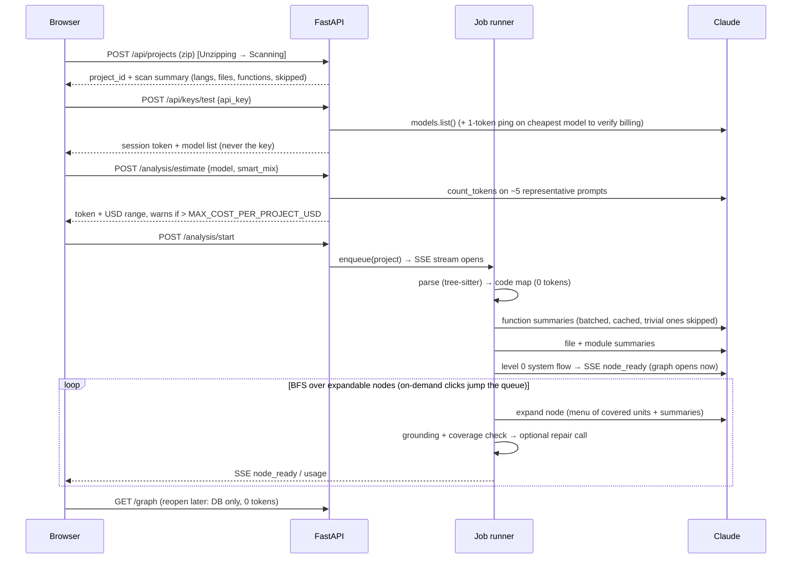

# CodeFlow Explorer — Architecture

CodeFlow Explorer turns an uploaded project `.zip` into an interactive, drill-down flow graph
(START → stages → … → steps inside one function) that a non-programmer can read. Claude does the
explaining; deterministic static analysis does everything it can first so that every node is
grounded in a real file and line range and the token bill stays small.

## 1. Components



### Backend layout

```
backend/app/
  main.py            app factory, middleware (CORS, secure headers, rate limit), lifespan (workers, cleanup)
  config.py          pydantic-settings; reads .env; loads config/models.json (fallback list, prices, tier hints)
  logging.py         structlog + API-key redaction processor (applied to every log record)
  api/               routers, request/response schemas, error handlers, DI providers
  export/            self-contained HTML export (viewer.py + viewer_template.html)
  models/            SQLAlchemy ORM + session factory
  parsing/           tree-sitter code map: language registry, .scm queries, extractor, entry points
  pipeline/          unzip, scan, codemap, summaries, flow (level 0 + expand), grounding, estimate, jobs, events, cost, cleanup
  llm/               ClaudeClient protocol, Anthropic + Mock implementations, prompts, JSON schemas, key store, model catalog
backend/config/models.json   editable fallback model list + per-model prices + tier hints
backend/tests/               pytest (all LLM tests use MockClaudeClient)
```

### Frontend layout

```
frontend/src/
  app/                 App Router pages: / (upload+connect+estimate+progress wizard), /projects, /projects/[id]/graph
  components/          upload, connect, estimate, progress, graph (canvas, nodes, side panel, breadcrumbs, search, export)
  lib/api.ts           typed fetch client (zod-validated responses), SSE subscription
  lib/layout.ts        elkjs layered layout for nested (compound) nodes
  lib/graph-state.ts   expand/collapse/focus state, ancestor path resolution
  lib/schemas.ts       zod schemas mirroring backend Pydantic models
```

## 2. Data flow



### Hierarchy model

Every node **covers** a set of static *units* (module → file → class/function) from the code map.
The unit ids (`path/to/file.py::Class.method`) are the grounding vocabulary: Claude may only assign
units from the menu it was given, and every `code_ref` must fall inside a real file and line range.

| Node scope | Menu given to Claude | Children produced |
|---|---|---|
| system (level 0) | tree + README excerpt + entry points + module summaries | START / stages / OUTPUT |
| stage covering > 12 files | modules (directories) with summaries | groups of modules/files |
| stage/group covering ≤ 12 files | files with summaries | file nodes (or small groups) |
| one file | classes + functions with summaries and signatures | function/class nodes |
| one function | numbered source lines + callee/caller signatures | steps (each tied to a line range) |

**Leaf rule.** A function is a leaf when it is < 15 lines *or* calls nothing else in the project.
Its expansion is its internal steps; step nodes never have "Go deeper". A step in a non-leaf function
that calls another project function carries a `code_ref` to the callee so the user can keep drilling.
Depth therefore adapts to project size: System → Stages → (Modules) → Files → Functions → Steps.

**Coverage.** Children must together cover every unit of the parent. Unassigned units trigger one
repair call that receives *only* the missing unit ids and the child list, never the whole context.

## 3. Key decisions (and what was rejected)

| # | Decision | Why | Rejected alternatives |
|---|---|---|---|
| 1 | **tree-sitter via the 11 official grammar wheels** (`tree-sitter-python`, `-javascript`, `-typescript`, `-java`, `-go`, `-c`, `-cpp`, `-c-sharp`, `-ruby`, `-php`, `-rust`) | Pre-built wheels for macOS/Linux, pinned versions, ABI 14/15 compatible with `tree-sitter` 0.26, **no network at runtime**, no compilation. | `tree-sitter-language-pack` 1.x downloads grammars on first use (runtime network dependency, bad for Docker/offline). Regex/ctags: no call sites. LSP servers: would require running project toolchains — violates the "static only" hard rule. |
| 2 | **Structured outputs (`output_config.format`, JSON schema)** for every Claude call | GA, no beta header, guarantees parseable JSON with zero prose, supported on all current models including Haiku 4.5. Two schemas total (flow, summaries) so cache namespaces stay few. | Strict tool use: adds the tool-use system prompt (≈300–500 tokens/call). Free-text JSON: fragile, needs repair loops. Prefill: returns 400 on 4.6+ models. |
| 3 | **Prompt layout = [global rules+schema notes] → [project context] → per-call user text**, explicit `cache_control` on the two system blocks | Prefix-match caching; global block is shared across projects, project block across all calls for one project. Minimum cacheable prefix is 512 (Opus 5) / 1024 (Sonnet 5) / **4096 (Haiku 4.5)** tokens, so the project context lives in the cached prefix to reach the threshold on the cheap model. | Top-level automatic caching alone would key the cache to the varying tail. |
| 4 | **Bottom-up summaries** (function ≤ 20 words → file → module), batched ≈ 6k code tokens per call, trivial functions summarized from static data | Higher levels read summaries, never raw code; batching removes per-call overhead; trivial skip removes 20–40 % of calls on typical code. | Sending raw files to the level-0 prompt (token explosion, weak grounding). Lazy-only summaries (level 0 needs module summaries anyway). |
| 5 | **elkjs `layered` layout in the browser**, compound nodes for expanded containers | Only mainstream JS layout engine with proper hierarchical (compound) support; left-to-right layered graphs read like a flow; runs in a worker so relayout animates without server round-trips. | dagre: no compound nodes. d3-force: not layered. Graphviz server-side: binary dependency, no smooth animation. |
| 6 | **In-process asyncio priority queue** (`JobRunner` protocol) with `LLM_CONCURRENCY` workers | One process, zero infra; priority lets on-demand clicks jump ahead of BFS background work; protocol boundary allows a Redis/Celery swap. | Celery/RQ/arq: extra broker, more moving parts than a BYOK single-node app needs. |
| 7 | **SQLite + SQLAlchemy 2 async** for projects/jobs/nodes/edges/cache/usage; files on disk under `workspace/<id>/` | Queryable (search, ancestor paths), transactional, single file, trivially backed up; reopening a project costs 0 tokens. | Postgres: overkill. JSON files: no search, no concurrent writes. |
| 8 | **SSE** for live progress | One-directional stream fits progress events; works through plain HTTP; auto-reconnect with `Last-Event-ID` replay. | WebSockets: bidirectional not needed. Polling: laggy, chatty. |
| 9 | **API key never leaves the server**: `POST /api/keys/test` returns an opaque `X-Session-Token`; key kept in memory, optionally Fernet-encrypted at rest with `KEY_ENCRYPTION_SECRET` | Meets the "never return keys to the browser" rule; token is what the browser stores. Redaction processor scrubs `sk-ant-…` from every log record and error message. | Cookies: cross-port CORS + SameSite complexity for no gain. |
| 10 | **Model list from `GET /v1/models`** with `capabilities`; `config/models.json` holds the fallback list, prices and tier hints matched by id prefix | Live list per key; capability flags decide whether `output_config.effort`/adaptive thinking can be sent; prices editable without code changes; no model id in logic. | Hardcoded ids (forbidden by the brief). |
| 11 | **Smart mix** = selected model for summaries above function level, level 0 and stage/file expansions; cheapest structured-output-capable model from the fetched list for function summaries and step-level expansions | Deep levels are many small calls with narrow scope — the cheap model handles them well; the top levels need judgement about grouping and narrative. | Single model everywhere (user can still choose that). |
| 12 | **Content-hash LLM cache**: `sha256(task, model, prompt_version, payload)` → response JSON in `llm_cache` | Identical functions across projects or re-uploads cost nothing; prompt_version bump invalidates safely. | Caching by project only. |
| 13 | **MockClaudeClient is payload-driven**: every request carries the structured `payload` that was rendered into the prompt; the mock builds a grounded graph from it | Tests and the Playwright run exercise the *real* pipeline (grounding, coverage, persistence) on any project without a key. | Canned fixture responses (only valid for one fixture project). |
| 14 | Frontend calls the backend directly (`NEXT_PUBLIC_API_URL`), CORS locked to `FRONTEND_ORIGIN` | SSE streams reliably without a proxy layer; no secrets in the bundle (the URL is public). | Next.js rewrites (proxy buffering risk for SSE). |
| 15 | Thinking: omitted (adaptive default) with `output_config.effort` = `low` for summaries/steps and `medium` for level 0/stage expansions, **only when the model's capability flags say effort is supported**; nothing is sent otherwise | Correct on Opus 5/Sonnet 5 (adaptive default), safe on Haiku 4.5 (no `effort`, no `thinking`). | `budget_tokens` (400 on current models). |
| 16 | **Shareable export is one self-contained HTML file** with the graph, its snippets and a ~450-line vanilla-JS viewer (its own layered layout, pan/zoom, expand, search, side panel) | The recipient usually has no server and may have no internet. No CDN means no broken page in a year; no build step means the exporter stays a template plus JSON. Snippets are capped (60 lines each, 1.5 MB total) so the file stays emailable. | Bundling React Flow + ELK from a CDN (breaks offline, and pins us to a CDN staying up); a hosted public link (needs auth, storage and a public deployment this tool deliberately avoids); PNG only (not interactive, which is the whole point). |
| 17 | Refusals (`stop_reason == "refusal"`) surface as a node error with a plain message; no server-side fallback model | The user chose the model deliberately and pays for it; silently switching models would break the cost estimate. Code-analysis prompts rarely trigger refusals. | `fallbacks` beta. |

## 4. Token-efficiency design

1. Static first: tree-sitter builds files/classes/functions/calls/imports/entry points with 0 tokens.
2. Summaries flow upward; raw code is sent only at function level and only the function's lines.
3. Two cached system blocks (global rules, project context); per-call text is last.
4. `output_config.format` JSON schema; tight `max_tokens` per task (summaries 2k–4k, flow 4k, steps 3k, repair 2k); `stop_reason == "max_tokens"` retries once with a larger cap.
5. Compact code map (`{"i":id,"f":file,"l":[s,e],"s":summary}`, no whitespace).
6. Batched summaries; trivial functions (getters/setters/one-liners) get template text.
7. Content-hash cache across projects; prompt_version in the key.
8. Cost limit: estimate before start, running total during, pause + ask above `MAX_COST_PER_PROJECT_USD`.
9. Usage per call (input, output, cache write, cache read) persisted in `usage_events`, totals streamed to the UI.
10. Background generation stops at `BACKGROUND_MAX_NODES`; the rest is generated on demand.

## 5. Security model

- Zip: size/entry/ratio limits, path normalisation (zip-slip), symlink and device entries rejected, extraction aborted when the running unzipped total exceeds `MAX_UNZIPPED_MB`.
- Uploaded code is never executed, imported, installed or built; only read as text.
- Code is untrusted: the system prompt instructs Claude to ignore instructions inside code; outputs are JSON validated against schemas and grounding; nothing in an output can trigger an action.
- Snippets are served only from `workspace/<project_id>/src` after path normalisation and symlink refusal.
- API keys: memory only by default; Fernet at rest when remembered; regex redaction in logs and error messages; never in responses.
- CORS locked to `FRONTEND_ORIGIN`; secure headers; per-token/IP rate limits on upload and analysis; workspace retention job.

## 6. Decisions log (ambiguities resolved)

- **Test connection cost**: `models.list()` validates the key for free; a 1-token `messages.create` on the cheapest listed model (< $0.0001) is sent to detect "no credits" early. Both errors map to the plain messages.
- **Leaf node semantics**: a function node has children (its steps); step nodes are terminal. "Leaves have no Go deeper" applies to step nodes.
- **Session identity**: opaque random token in the `X-Session-Token` header; stored in `sessionStorage` (or `localStorage` when "remember key" is on).
- **Background depth**: BFS until `BACKGROUND_MAX_NODES` (default 200) nodes are generated or the cost limit is hit; everything else on demand.
- **Models without structured-output support** are listed but disabled in the dropdown with the hint "not supported by this app".
- **Frontend TypeScript** pinned to 5.x (Next 16 tooling targets it); TypeScript 7 is not yet supported by `typescript-eslint`.
- **React Flow owns node state** (`useNodesState`/`useEdgesState` with `onNodesChange`): a controlled node list without a change handler never records measurements, which silently breaks the minimap and fit-to-view. Layout still writes positions in; only measurement and selection flow back.
- **Minimap colours are resolved from the DOM**, because SVG `fill` presentation attributes cannot read `var(--token)`; the values are re-read when the theme changes.
- **Expanding zooms to the opened node** rather than re-fitting the whole graph, so text stays readable as depth grows.
- **Empty files are dropped from a node's code refs** unless they are all it has, so the side panel never opens on a blank snippet.
- **SSE is verified against a real socket** in tests: httpx's in-process ASGI transport buffers streaming responses, so a live `uvicorn` fixture is used for that one case.
- **`llm_errors()` wraps every client call site** so an unmapped SDK exception can never reach the user as an opaque 500.
- **Tokenizer drift**: the estimate is calibrated with `count_tokens` on the selected model, so newer tokenizers (~30 % more tokens) are accounted for automatically.

## 7. Verification status

Everything in the Definition of Done is verified by an automated test except `docker compose up`,
which could not be built on the development machine (its Docker VM disk was full). The compose file
and both Dockerfiles are syntactically validated (`docker compose config`), and the backend image
builds to completion — only the final layer unpack failed for lack of space.

## 8. Trade-offs accepted

- SQLite limits horizontal scaling; fine for a single-node BYOK tool. The `JobRunner` protocol and repository layer are the seams for a later split.
- Very large projects (> 20k files) are rejected by configuration rather than paginated.
- Languages without a grammar wheel fall back to Claude-only reading (file summaries from the first ~120 lines) and cannot produce step-level nodes.
